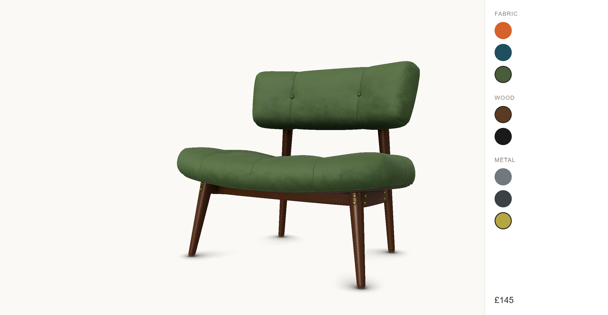

# Chair Configurator

A 3D product configurator built with vanilla Three.js and TypeScript. Load a chair model, orbit it, swap materials per part, watch the price update, and share the material configuration link.

**Live Demo:** _(coming soon)_

## Architecture

- Experience owns the chair configurator app. `main.ts` owns the DOM and knows nothing about the Three.js internals, so that the app can drop into any page. Experience is instantiated from `main.ts` with a canvas.

- Config driven product data - Product data (categories, options, prices and part mappings) lives in one typed config file (`productConfig.ts`); the UI panel, price calculation and material generation all get their data from it.

- The store (`ConfiguratorStore.ts`) is plain TypeScript, no DOM or Three.js dependency, which also makes the store unit testable. 17 tests cover the store's contract, config invariants and URL parsing at the untrusted boundary. UI calls select → store notifies → scene and panel re-render from state. 

